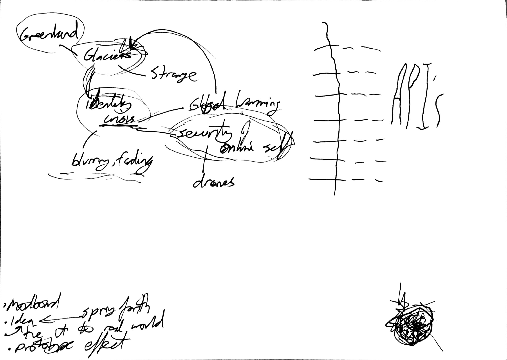
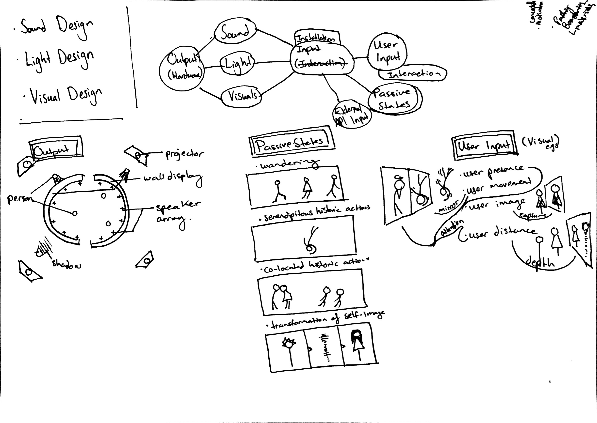

#Concept Focusing & Moodboarding

##Articulating Logistics and Topics

Our second meeting had us defining the concepts floating around in our minds since reading the DevArt brief. It began by focusing upon certain topics for discussion: the strange nature of glaciers, abstractions, disorientation, “other-worldliness”, exploration, misinterpretation, phantasmagoria, feedback mechanisms, “conversations beyond the light”, and identity of self. 

Along with defining the conceptual nature of our project, we discussed what shared interests we had in terms of cutting-edge technologies and interaction techniques we could utilise for the artwork. 

In order to make sense of and modularize the logistics of the installation, we compartmentalised it into the following themes: 

* Input Methods
* Input
* Mediums (Sound,Light,Visuals) and 
* Output. 

This framework provided us a succinct structure for elaborating on different scenarios.

##Moodboarding!
After we had some leads, we conducted a fun and intense session of moodboarding. We used murally to collate different sources of inspiration which we then grouped, and finally combed through and enlarged the inspirations that stood out most for the project. The full mural can be found here, and will be updated as we continue with the project: [Moodboard](http://mrl.li/1eiLas7).

##Takeaways
We discussed each individual piece that we placed on the moodboard, and will be looking more into concepts surrounding:

* The Ganzfield Effect, 
* Optical illusions and the treacherous workings of perception,
* The nature of recursion, 
* Human imprints on and in space/time,
* Lit sound.

This informed our final sketches of different projector setups where humans have a subliminal but recursive impact on the installation’s eternal visualisation of self.

Mark has toyed with the aesthetics of video feedback from a previous unfinished project, which we feel may have a place in our concept. We plan on exploring this notion further.
Our next step: actually getting down to some code, and prototyping some of these ideas!

Stay tuned …

*Our perception of visionary objects possesses all the freshness, all the naked intensity, of experiences which have never been verbalised, never assimilated to lifeless abstractions.*
 — Aldous Huxley

