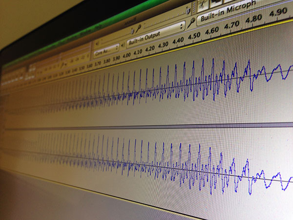
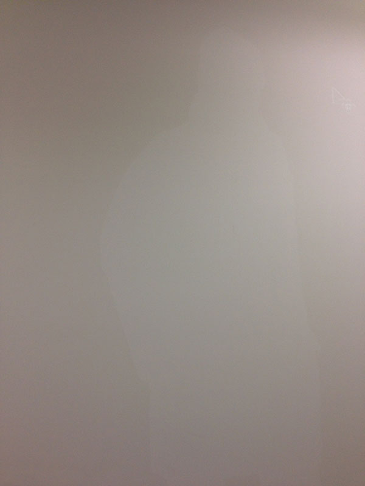

Experiments with recursion
==========================

This week we experimented with using a physical recursion loop the old-fashioned way, like good ol' 90s video art. 

We are interested in the topic of recursion as it is somewhat intimately related to the infinite, a feeling also present when surrounded by a vast nothingness, tying into our ideas generated from our moodboard ([see our post Concept Focusing & Moodboarding](2014-26-02-Concept-Focusing-And-Moodboarding.md).

Using a pico projector, we set its source of projection as a camera that was recording the projection itself. This gives a really nice, hazy look, and we're getting closer to our vision of a disorientating, ganzfield-type effect in a featureless room (except for the projectors and potential cameras).

<iframe width="560" height="315" src="//www.youtube.com/embed/sLPLzXGfX84" frameborder="0" allowfullscreen></iframe>

The recursive video feed can produce some really great blur washes and a sort of *melting* effect, but it's very fiddly to find the sweet spot of nice colours and a wash of movement. Usually it just ends up being a mix of hard video lines and a lot of ugly grays and browns.

There were other problems we thought of when considering this idea for the installation:

If the camera is behind the viewers, how do we make sure someone doesn't block the camera too much? We could place the camera on the roof looking down towards the wall and compensate for the perspective warping, but then viewers would have to get very close to the wall to have any effect on the recursion, which means they'll be in the beam of the projector which will cast a shadow. 

Ideally, we want to avoid shadows, keeping the projection surfaces absolutely clear and ganzfield-like. We have a vision of a space that could feel almost infinite.

We are still entertaining the idea of having the viewers end up being apart of, or contribute in some way, to the installation. From previous experiments with recursive video feeds, the public can have a real blast simply by placing their limbs in front of the feed and watching themselves melt into the screen. However, because of its fiddly nature and also concerns regarding where we could setup the camera and projector effectively, we may have to think of a workaround.

The Soundscape
==============

We also had a discussion about how a soundscape would be really fitting.

We experimented with slowing down recorded sound so much, that the minute changes in pitch and rhythm in natural speech could become the soundscape, a sort of dirge for the installation.

Recording video of the viewers through the use of the cameras used for the recursion effect led us to thinking about recording audio as well. 

We looked into using the `Google Web Speech API` in somewhat of a subversive way: by recording any words spoken by the viewers passively, the recording could be sent to the `Google Web Speech API`, and converted into words, sometimes correct, sometimes misinterpreted. A poem could be made from the "found" words of vistors by the system, and then played back as a soundscape.

Lots of interesting thoughts and leads to follow!

