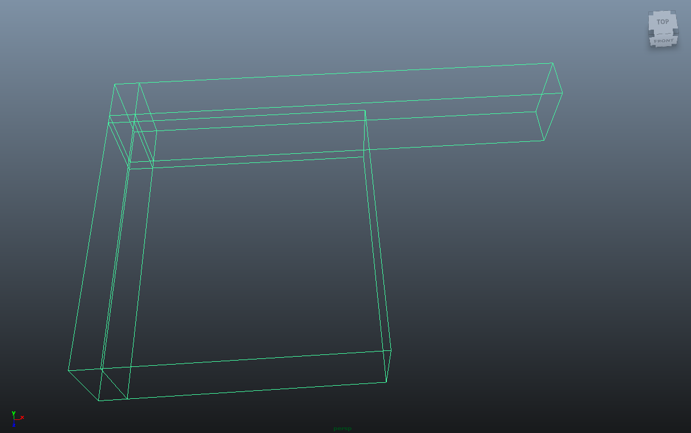
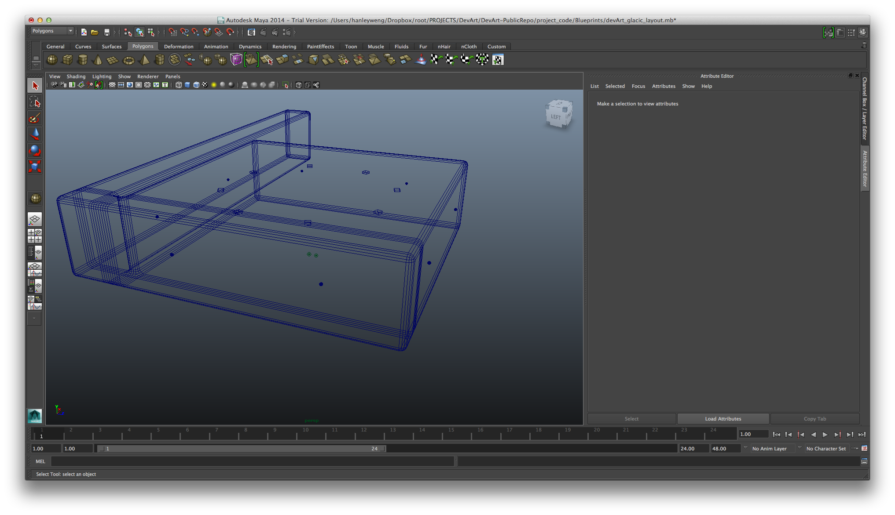

#Blueprints

Finally visualising the structure in three dimensions helped us refine the layout of the intended space. 

Early wireframes let us specify more accurately the measurements for different segments of the space such as the entrance width. The model below shows a long corridor that eventually turns into a 10m by 10m room. This size was chosen as a sufficient area that could help us deliver the felling of an infinite space when it is lit and fogged.

After a few different projector and camera setups, and with a bit of chamfering, we get:

The chamfering is required on the ceiling, floor, and walls, to remove any edges in the space. This is done so humans have a harder time discerning distances, especially when deprived of sufficient visual information offered by contrast. Being unable to distinguish distances, loosing one self in an infinite space, is one of the key feelings we wish to convey in the installation.

Here’s a panning view of the space with some dummy projections:

<iframe width="420" height="315" src="//www.youtube.com/embed/pgD6yKw5jzA" frameborder="0" allowfullscreen></iframe>