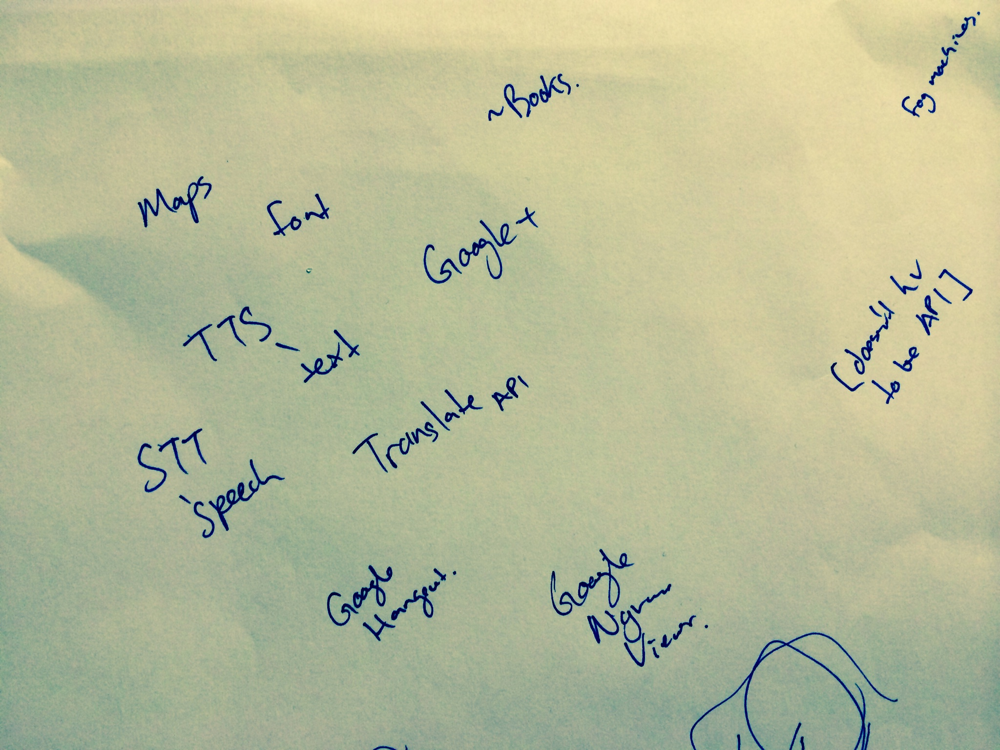
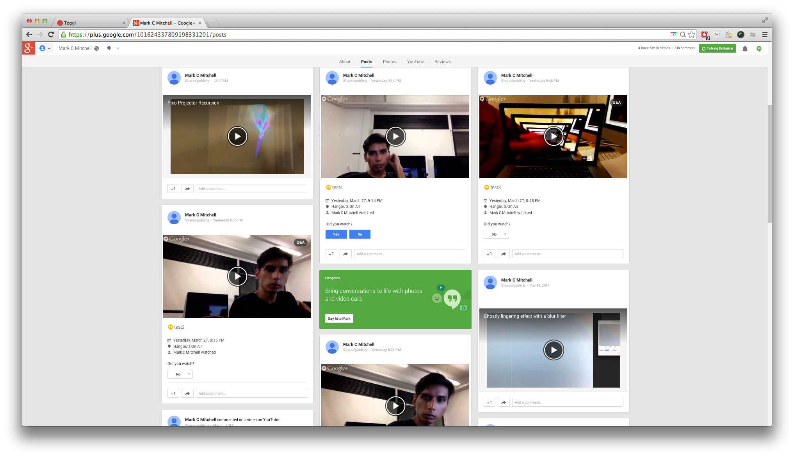

# Hangouts Meeting

Brainstorming around for APIs, we had narrowed it down to text to speech, and speech to text. Suddenly, we remembered that Google+ Hangouts had an api. 

We were keen on using google+ hangouts but weren’t quite sure how well the api would integrate with our installation – until we realised, we didn’t need to use the api explicitly! (hack ftw!)

Here’s a few shots of us testing out what we could do with G+ hangouts.

At one point we had 2 laptops and a phone airing a hangout to 2 other desktops. Quite narcissistic :] 

<iframe width="560" height="315" src="//www.youtube.com/embed/CsCWXOoZfJw" frameborder="0" allowfullscreen></iframe>